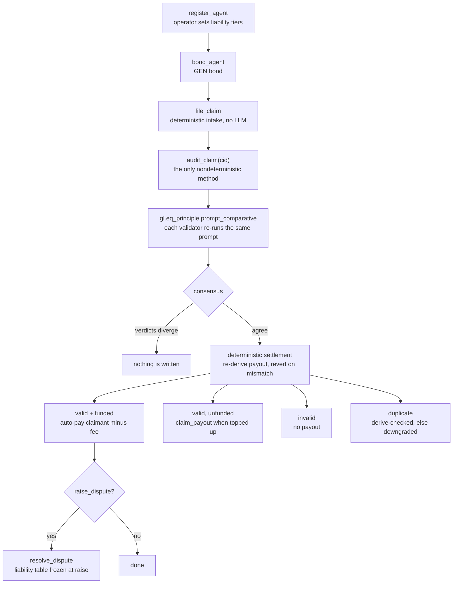

# AgentSheild — AI-Audited Agent Liability Primitive (GenLayer Intelligent Contract)

[](#testing)
[](#deploy--run)
[](#live-deployments)
[](contracts/AgentSheild.py)
[](#live-deployments)
[](LICENSE)

Standalone, reusable primitive for bonded AI-agent trust: operators register
agents with a conduct policy and per-severity liability tiers, post a GEN bond,
users file incident claims, GenLayer validators reach LLM consensus on whether
the agent misbehaved, valid claims auto-pay out, disputes go to owner
arbitration.

**Quick start**

```bash
python3.12 -m pytest tests/ -q                    # 10 passed
python3.12 scripts/preflight.py                   # 32/32 structural checks
GENVM_VERSION=v0.3.0-rc7 genvm-lint check contracts/AgentSheild.py   # lint + validation ok
```

## Live deployments

| Role | Address | Deploy tx | Consensus on deploy |
|---|---|---|---|
| **Official** | [`0xEc80b9C592282aF5cc0eC0aeC3b7cdfD03CE0E75`](https://explorer-studio.genlayer.com/address/0xEc80b9C592282aF5cc0eC0aeC3b7cdfD03CE0E75) | `0xda146f42…5f0f216` | 3 agree / 2 idle (FINALIZED) |

Open it in Studio with
[`?import-contract=`](https://studio.genlayer.com/?import-contract=0xEc80b9C592282aF5cc0eC0aeC3b7cdfD03CE0E75).
The deployment runs source that is **byte-identical** to this repo's contract
(sha256 `f45dde8c…6393b8`, 23470 bytes, 506 lines). Verify it yourself in one
line:

```bash
curl -s -X POST https://explorer-studio.genlayer.com/api -H 'content-type: application/json' \
  -d '{"jsonrpc":"2.0","id":1,"method":"gen_getContractCode","params":["0xEc80b9C592282aF5cc0eC0aeC3b7cdfD03CE0E75"]}' \
| python3 -c 'import json,sys,base64; sys.stdout.buffer.write(base64.b64decode(json.load(sys.stdin)["result"]))' \
| cmp - contracts/AgentSheild.py && echo byte-identical
```

Receipts, source verification, and empty-state reads live in
[`proof/`](proof/). The deployment is live but unused so far: the first
`audit_claim` consensus receipt has not been produced — run
`scripts/smoke.sh --write` against the address to create it.

## What it does



Everything except `audit_claim()` is deterministic: intake, bond math, fee
splits, status transitions, payouts, and arbitration never touch an LLM.

## Why this is not a "thin LLM wrapper"

| Reviewer concern | How AgentSheild answers it |
|---|---|
| Generic "AI decides X" | Audit is grounded in on-chain inputs only (policy + claim + existing valid-claim summaries). Validators re-run the same prompt independently. |
| Schema-only validation | Consensus is `gl.eq_principle.prompt_comparative` with a substantive principle (decision must match exactly, severity within one tier, **derived `reward` must be identical** — the GEN amount each verdict would pay). No `strict_eq` on LLM text. |
| Blind trust in LLM ids | Duplicate verdicts are **derived-checked**: the cited `duplicate_of` must exist, belong to the same agent, and be `valid/paid` — else downgraded to `valid`. |
| Hallucinated JSON | Defensive parsing (`_clean`/`_norm`): dict passthrough, fenced-JSON stripping, substring extraction, key-variation tolerance (`decision` vs `is_valid`/`is_duplicate`), severity coercion. |
| Mixed nondet + money | LLM runs inside `audit_fn` only. All bond math, fee splits, and status transitions are deterministic settlement **after** consensus. |
| Storage anti-patterns | `TreeMap` index maps, `u256` atto-scale money, `@allow_storage` structs, appended-only layout. `dict`/`list`/`float` never touch storage. |

## How consensus works (one method only)

`file_claim()` is fully deterministic — no LLM, so intake is cheap and
censorship-resistant. `audit_claim(claim_id)` is the **only** nondeterministic
method:

1. Copy `Agent` + `Claim` to memory (`gl.storage.copy_to_memory` — storage is
   invisible inside nondet blocks).
2. Build a bounded dedup context (`_summaries`: last 60 claims, max 20 lines).
3. `audit_fn` calls `gl.nondet.exec_prompt(prompt, response_format="json")`,
   normalizes it, then derives `reward` deterministically from
   `severity + the agent's liability table` (`_tier_payout`) and returns
   `{"decision","severity","duplicate_of","reason","reward"}`.
4. `gl.eq_principle.prompt_comparative(audit_fn, principle)` — every validator
   re-runs the prompt; an `EqComparative` LLM judge accepts only equivalent
   verdicts: identical `decision`, matching `duplicate_of`, severity within one
   tier, and **identical `reward`** — the exact GEN amount each verdict would
   pay — so tier-tolerant severity can never move the transferred amount.
   Divergent audits fail consensus and write nothing.
5. Deterministic settlement: apply the decision (including the derived-check
   duplicate→valid downgrade), recompute the tier payout from stored tiers and
   require it to equal the consensus `reward` (any mismatch reverts — fail
   closed), auto-pay via `emit_transfer` (claimant gets `payout - fee`, owner
   gets fee), or leave `valid` claimable if the bond is underfunded.

All other writes (`register/bond/pause/resume/delist`, `claim_payout`,
`raise/resolve_dispute`, admin) are deterministic.

## State design

- Counters: `next_agent_id / next_claim_id / next_dispute_id` (`u256`, start at 1; `0` = none).
- Maps: `agents`, `claims`, `disputes` (`TreeMap[u256, Struct]`).
- Indexes (O(1), no nested generics): `agent_claim_counts` + `agent_claim_index["aid:idx"]`,
  `claimant_claim_counts` + `claimant_claim_index["addr:idx"]`.
- Money: per-severity `u256` liability tiers + `bond_bal` ledger per agent; the
  contract balance holds the pooled GEN, the ledger prevents overspend.

## API reference

20 methods: 14 write, 6 view. Authorities: `owner` = contract owner,
`operator` = agent registrant, `claimant` = claim submitter.

| Method | Type | Who | What |
|---|---|---|---|
| `register_agent(name, policy, desc, l_crit, l_high, l_med, l_low)` | write | anyone | Open agent, returns `aid`. Liabilities must descend. |
| `bond_agent(aid)` | write.payable | operator | Add GEN bond. |
| `pause_agent / resume_agent / delist_agent` | write | operator | Lifecycle; delist refunds bond. |
| `update_liabilities(...)` | write | operator | Retier liability table. |
| `file_claim(aid, title, desc, evidence, impact, sev)` | write | claimant | Deterministic intake, returns `cid`. |
| `audit_claim(cid)` | write (consensus) | anyone | LLM audit + auto-pay. Returns decision dict. |
| `claim_payout(cid)` | write | anyone | Pay a `valid` claim once bonded. |
| `raise_dispute(cid, reason)` | write | claimant/operator | Freeze to `disputed`, returns `did`. |
| `resolve_dispute(did, outcome, sev)` | write | owner | Arbitrate + pay if `valid`. |
| `requeue_disputed(cid)` | write | owner/operator | Back to `pending` for re-audit. |
| `get_agent / get_claim / get_dispute` | view | anyone | Single struct as a primitive-only dict. |
| `get_agent_claims(aid, offset, limit)` | view | anyone | Paginated claim ids (JSON-array string to keep the ABI primitive). |
| `get_pending_queue(limit)` | view | anyone | Pending claim ids (same convention). |
| `get_agent_stats(aid)` | view | anyone | Counts, paid totals, bond balance. |
| `set_fee / transfer_ownership` | write | owner | Fee ≤ 10%, ownership. |

## Testing

| Suite | Count | Covers | Command |
|---|---|---|---|
| Direct Mode (leader-only, mocked LLM) | 6 | register/file, auto-pay when funded, hallucinated duplicate downgraded, bad severity rejected, arbitration pays from the bound liability table, delisted-agent retier guard | `python3.12 -m pytest tests/direct -v` |
| Normalizer / helpers (no node) | 4 | fenced JSON, key variants, garbage + severity coercion, deterministic tier payout | `python3.12 -m pytest tests/test_normalizer.py -v` |
| Offline preflight | 32 checks | structural audit without a GenVM runtime | `python3.12 scripts/preflight.py` |
| Lint + schema validation | — | pinned runner, storage types, ABI | `GENVM_VERSION=v0.3.0-rc7 genvm-lint check contracts/AgentSheild.py` |

Everything in one go:

```bash
python3.12 -m pytest tests/ -q     # 10 passed (~0.2s)
```

## Deploy / run

The contract is already deployed on StudioNet:

```bash
export AGENTSHEILD=0xEc80b9C592282aF5cc0eC0aeC3b7cdfD03CE0E75
```

To deploy elsewhere, and then run the lifecycle:

```bash
GENVM_VERSION=v0.3.0-rc7 genvm-lint check contracts/AgentSheild.py   # expect: lint ok
npm install -g genlayer
genlayer network set studionet
genlayer deploy --contract contracts/AgentSheild.py
# bond (2 GEN), file, audit:
export AGENTSHEILD=<deployed address>
genlayer write "$AGENTSHEILD" bond_agent --args 1 --value 2000000000000000000
genlayer write "$AGENTSHEILD" file_claim --args 1 "Agent leaked my email" "..." "..." "PII exposure" high
genlayer write "$AGENTSHEILD" audit_claim --args 1
genlayer call "$AGENTSHEILD" get_claim --args 1
```

Or run the whole lifecycle, including the dispute path, in one command:

```bash
AGENTSHEILD_CONTRACT=0xEc80b9C592282aF5cc0eC0aeC3b7cdfD03CE0E75 scripts/smoke.sh --write
```

Read-only smoke (all 6 views, spends nothing):

```bash
AGENTSHEILD_CONTRACT=0xEc80b9C592282aF5cc0eC0aeC3b7cdfD03CE0E75 scripts/smoke.sh
```

Full annotated command sheet: [`DEPLOYMENT.md`](DEPLOYMENT.md).

## Repository layout

```text
contracts/AgentSheild.py   the primitive, 506 lines, single file
DEPLOYMENT.md              annotated deploy + smoke command sheet
proof/                     live receipts, byte-identity, empty-state reads
scripts/preflight.py       offline audit, no GenVM runtime required
scripts/smoke.sh           CLI read + write lifecycle smoke sequence
tests/direct/              Direct Mode: leader-only, mocked LLM (6 tests)
tests/test_normalizer.py   pure helpers vs adversarial LLM output (4 tests)
docs/                      (planned) architecture, consensus, integration, threat model
artifacts/                 gltest build output (gitignored)
```

## Reuse ideas

Bonded AI-judgment pattern ports to freelance deliverable audits, API-abuse
liability for agents, insurance claims adjudication, content-moderation
appeals, and agent-to-agent SLA disputes — swap the audit prompt + liability
tiers, keep the consensus/settlement split.

## License

MIT
